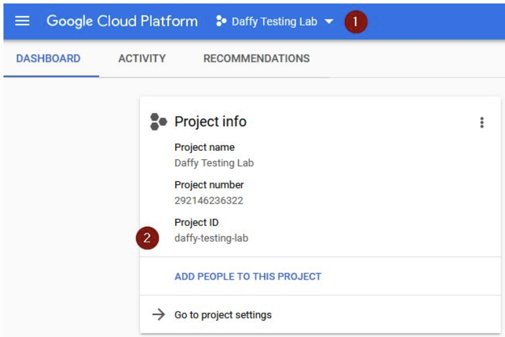
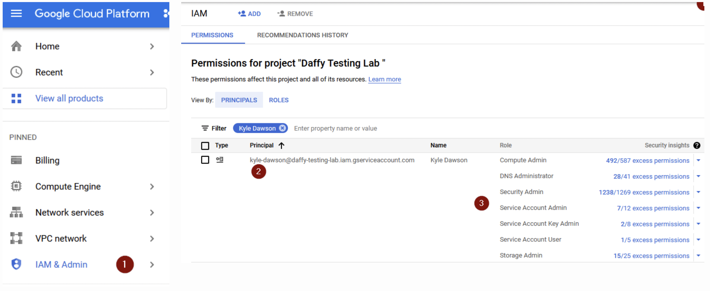
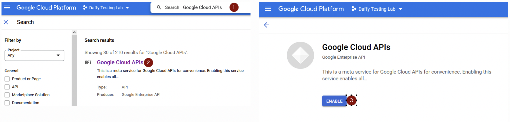
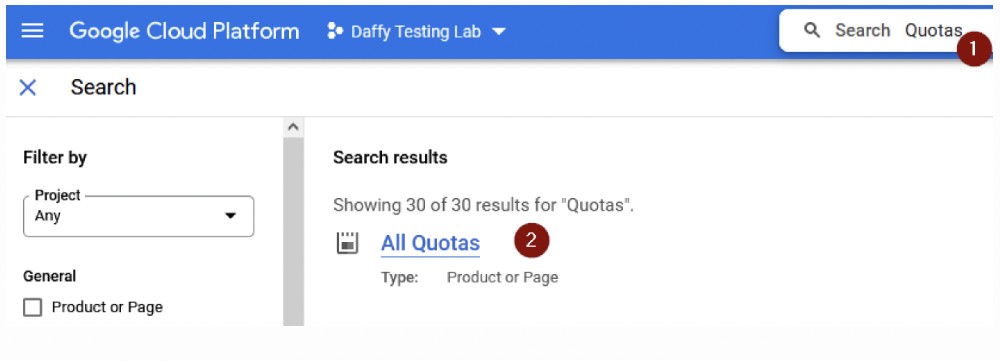
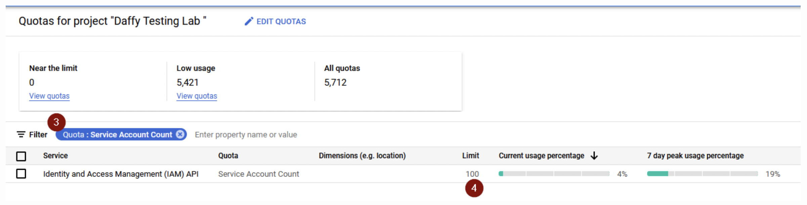
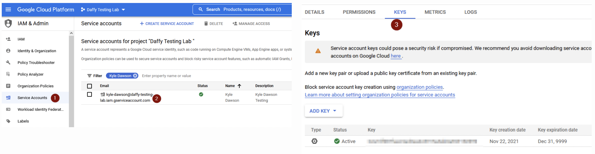

---
hide:
  - footer
---

# GCP Install


At this point, you have a **bastion** machine where you have installed the Daffy tool, created your core **<environment-name>-env.sh** and can execute the install of **OCP** on **GCP**.

## Platform Requirements

To use Daffy on **G**oogle **C**loud **P**latform, there are some platform info and requirements that need to be gathered or met. We have a simple doc that you should refer to that list all providers and what would be needed.  For GCP, it breaks down to the following basic three items:

**Account Details** - The account that you plan to install OpenShift

**Permissions** - The permissions need to perform the install

**Quota** - The ability to add new workload to that platform

For detailed list of the above, you can find in the Daffy Provider Requirements. Please review before proceeding.

[https://ibm.box.com/v/DaffyProviderRequirements](https://ibm.box.com/v/DaffyProviderRequirements){target=_blank}

## Finding Provider Details

To install Daffy on **G**oogle **C**loud **P**latform, the hardest part can be finding the provider details.

Project ID

To find your GCP project you can refer to this:

[https://cloud.google.com/resource-manager/docs/creating-managing-projects](https://cloud.google.com/resource-manager/docs/creating-managing-projects){target=_blank}

1. You can list your Project ID from the Drop down
2. You can see your Project ID from the Dashboard



Identifying a region or zone

Each region in Compute Engine contains a number of zones. Each zone name contains two parts that describe each zone in detail. The first part of the zone name is the **region** and the second part of the name describes the **zone** in the region:

Region

Regions are collections of zones. Zones have high-bandwidth, low-latency network connections to other zones in the same region. In order to deploy fault-tolerant applications that have high availability, Google recommends deploying applications across multiple zones and multiple regions. This helps protect against unexpected failures of components, up to and including a single zone or region.

Choose regions that makes sense for your scenario. For example, if you only have customers in the US, or if you have specific needs that require your data to live in the US, it makes sense to store your resources in zones in the us-central1 region or zones in the us-east1 region.

**Region:**
To find a list of regions, you can refer to this:

[https://cloud.google.com/compute/docs/regions-zones](https://cloud.google.com/compute/docs/regions-zones){target=_blank}

What are service accounts?

A service account is a special kind of account used by an application or compute workload, such as a Compute Engine virtual machine (VM) instance, rather than a person. Applications use service accounts to make [authorized API calls](https://developers.google.com/identity/protocols/oauth2/service-account#authorizingrequests){target=_blank}, authorized as either the service account itself, or as Google Workspace or Cloud Identity users through [domain-wide delegation](https://developers.google.com/identity/protocols/oauth2/service-account#delegatingauthority){target=_blank}.

**Service Account:**

For you to use Daffy to install on **GCP**, you need to create a service account that has the correct permission to install.

[https://cloud.google.com/iam/docs/creating-managing-service-account-keys#creating](https://cloud.google.com/iam/docs/creating-managing-service-account-keys#creating){target=_blank}

**Permission:**

Within your **GCP** project, you would need to go to IAM  Section and create/use Service Account.  From the [requirements doc](https://ibm.ent.box.com/file/888540482997?v=DaffyProviderRequirements){target=_blank}, make sure your service account has the correct permissions.



**API Services Enabled:**

For each **GCP** project, you need to enable API access. Within your **GCP** project, you would need to enable each API needed for the OpenShift install. From the [requirements doc](https://ibm.ent.box.com/file/888540482997?v=DaffyProviderRequirements), you can search for each API and confirm/enable each API Service.



**Quota:**

For each **GCP** project, you need to enable API access. Within your **GCP** project, you would need to enable each API needed for the OpenShift install. From the [requirements doc](https://ibm.ent.box.com/file/888540482997?v=DaffyProviderRequirements){target=_blank}, you can search for each API and confirm/enable each API Service.

1. Search for "Quotas" within your GCP project
2. Select the "All Quotas"
3. Search for the quota you are looking for
4. Verify Limit/Used Percentage



**Once you open the "All Quotas" Page, you can search for each quota to see its limits.**



**Dedicated public host Zone:**

You will need to create a DZS hosted Zone project.  For the OpenShift install, you need the following:

1. Registered DNS Name **- myexample.com**
2. GCP DNS Zone        **- myexample-com**
3. Transfer the domain to GCP Name services listed in your new **GCP** DNS Zone

**Setting up DNS for GCP Deployment with OpenShift:**

  <div style="text-align:center">
<iframe width="560" height="315" src="https://www.youtube.com/embed/CAkWQnOJ88A" title="YouTube video player" frameborder="0" allow="accelerometer; autoplay; clipboard-write; encrypted-media; gyroscope; picture-in-picture" allowfullscreen></iframe>
</div>
## Environment File

Deploying the OpenShift on **GCP** only requires three entries to your **existing** core environment file (<**ENVIRONMENT_NAME**>-env.sh) plus a local service account file.

**Note:** You can look in the samples directory on your bastion for example of **GCP** install : /data/daffy/env/samples/**gcp-ipi-env.sh**

You can copy the sample file to build your **new** environment  file.

cp /data/daffy/env/samples/**gcp-ipi-env.sh** /data/daffy/env/<**ENVIRONMENT_NAME**>-env.sh

**Valid Options:**

**OCP_INSTALL_TYPE=** gcp-ipi

**GCP_PROJECT_ID=** [<YourGCPProjectID>](https://cloud.google.com/resource-manager/docs/creating-managing-projects){target=_blank}          

**GCP_REGION**= [<AnyValidGCPRegion>](https://cloud.google.com/compute/docs/regions-zones){target=_blank}

Optional:
**OCP_CREATE_OPENSHIFT_CONTAINER_STORAGE**=true

```
OCP_INSTALL_TYPE="gcp-ipi"
GCP_PROJECT_ID="<YourGCPProjectID>"       
GCP_REGION="<AnyValidGCPRegion>"
#OCP_CREATE_OPENSHIFT_CONTAINER_STORAGE=true
```

If you plan to install a cloud pak and/or need storage, you need to set the flag to setup OCS Storage

For **GCP**, you need to download your Service Key as well.  Save this to your home path:  **~/.gcp/osServiceAccount.json**


1. In your **GCP** project, go to IAM and Select Service accounts
2. Select or Create new Service Account
3. From the Service Account, select the Keys tab to create new Key.

*** FYI  after you create the Key, you can not view/download it.  You can only get the details at the time of creation



## Execution

To deploy your OCP cluster to GCP, run the build.sh script from the /data/daffy/ocp directory

```
/data/daffy/ocp/build.sh <ENVIRONMENT_NAME>
```

Once your cluster is fully deployed you can access the help menu which has a number of options.

**Note:** <ENVIRONMENT_NAME> is the first part of your name that you used for the <ENVIRONMENT_NAME>-env.sh file

```
/data/daffy/ocp/build.sh <ENVIRONMENT_NAME> --help
```

 <button onclick="location.href='../../Cloud-Paks/'" class="custom-btn btn-7">
 Installing Cloud Paks</button>


 <!-- PUT ANY JS OR CSS BELOW HERE-->

 <style>

 .frame {
   width: 90%;
   margin: 40px auto;
   text-align: center;
 }
 button {
   margin: 5px;
 }
 .custom-btn {
   width: 200px;
   height: 50px;
   color: black;
   border-radius: 10px;
   padding: 10px 25px;
   font-family: 'Lato', sans-serif;
   font-weight: 500;
   background: transparent;
   cursor: pointer;
   transition: all 0.3s ease;
   position: relative;
   display: inline-block;
    box-shadow:inset 2px 2px 2px 0px rgba(255,255,255,.5),
    7px 7px 20px 0px rgba(0,0,0,.1),
    4px 4px 5px 0px rgba(0,0,0,.1);
   outline: none;
 }

 /* 7 */
 .btn-7 {
 background: linear-gradient(0deg, rgba(255,151,0,1) 0%, rgba(251,75,2,1) 100%);
   line-height: 42px;
   padding: 0;
   border: none;
 }
 .btn-7 span {
   position: relative;
   display: block;
   width: 100%;
   height: 100%;
 }
 .btn-7:before,
 .btn-7:after {
   position: absolute;
   content: "";
   right: 0;
   bottom: 0;
   background: rgba(251,75,2,1);
   box-shadow:
    -7px -7px 20px 0px rgba(255,255,255,.9),
    -4px -4px 5px 0px rgba(255,255,255,.9),
    7px 7px 20px 0px rgba(0,0,0,.2),
    4px 4px 5px 0px rgba(0,0,0,.3);
   transition: all 0.3s ease;
 }
 .btn-7:before{
    height: 0%;
    width: 2px;
 }
 .btn-7:after {
   width: 0%;
   height: 2px;
 }
 .btn-7:hover{
   color: rgba(251,75,2,1);
   background: transparent;
 }
 .btn-7:hover:before {
   height: 100%;
 }
 .btn-7:hover:after {
   width: 100%;
 }
 .btn-7 span:before,
 .btn-7 span:after {
   position: absolute;
   content: "";
   left: 0;
   top: 0;
   background: rgba(251,75,2,1);
   box-shadow:
    -7px -7px 20px 0px rgba(255,255,255,.9),
    -4px -4px 5px 0px rgba(255,255,255,.9),
    7px 7px 20px 0px rgba(0,0,0,.2),
    4px 4px 5px 0px rgba(0,0,0,.3);
   transition: all 0.3s ease;
 }
 .btn-7 span:before {
   width: 2px;
   height: 0%;
 }
 .btn-7 span:after {
   height: 2px;
   width: 0%;
 }
 .btn-7 span:hover:before {
   height: 100%;
 }
 .btn-7 span:hover:after {
   width: 100%;
 }
 }
 </style>
