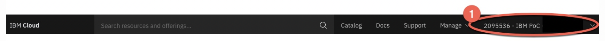

# ROKS install

At this point, you have a **bastion** machine where you have installed the Daffy tool, created your core **<environment-name>**-env.sh and can execute the install of **OCP** on **ROKS.**

## Platform Requirements

To use Daffy to provision **R**ed Hat **O**penShift **K**ubernetes **S**ervices on IBM Cloud (**ROKS**) , there are some platform info and requirements that need to be gathered or met. We have a simple doc that you should refer to that list all providers and what would be needed.  For ROKS, it breaks down to the following basic two items:

**Account Details** - The account that you plan to install ROKS

**Account Type** - The account type needed to perform the install

For detailed list of the above, you can find in the Daffy Provider Requirements. Please review before proceeding.

https://ibm.box.com/v/DaffyProviderRequirements

## Finding Provider Details

To use Daffy to install ROKS, you must find the provider details. Luckily, Daffy automates this as it walks you through this process using ibmcloud CLI. Below are the steps you can use to make sure you use the right information.

Account:

To find more details IBM Cloud account and how to manage you can refer to this:

https://cloud.ibm.com/docs/account?topic=account-account-getting-started

You must have an IBMid before logging in and the link above can help create one. If you are an IBM employee, after the number will most likely be your name.

You can list your Account ID from the Drop down



**Location/Zone:**
To find a list of available datacenter locations/zones, you can refer to this:

https://cloud.ibm.com/docs/overview?topic=overview-locations#mzr-table

**Note:** Daffy currently only supports **single** datacenter location installs with classic infrastructure

## Identifying a datacenter location/

Red Hat OpenShift on IBM Cloud has a number of locations geographically spread with single or multizone regions. Each zone name contains two parts that describe each zone in detail. The first part of the zone name is the datacenter **location,** and the second part of the name describes the **zone number** in the region. For ROKS, we currently only support a single datacenter deployment.

**Location/Zone**

Regions are collections of zones. Zones have high-bandwidth, low-latency network connections to other zones in the same region. In order to deploy fault-tolerant applications that have high availability, IBM recommends deploying applications across multiple zones and multiple regions. This helps protect against unexpected failures of components, up to and including a single zone or region.

Choose regions that makes sense for your scenario. For example, if you only have customers in the US, or if you have specific needs that require your data to live in the US, it makes sense to store your resources in zones in the dal13 zone or in the wdc07 zone. Daffy currently defaults to dal13 when deploying a ROKS cluster

**Account Type:**

For you to use Daffy to install on **ROKS**, you need to have a Pay-As-You-Go or subscription IBM Cloud account.

https://cloud.ibm.com/docs/account?topic=account-accounts

## What are account types?

Your IBM Cloud account includes many interacting components and systems for resource, user, and access management. Concepts like how certain components are connected or how access works help you in understanding how to set up your account type. Many features are free to use regardless of account type.

## Environment file

Deploying OpenShift on **ROKS** only requires one entry to your existing core environment file (<**ENVIRONMENT_NAME>**-env.sh).


**Note:** You can look in the samples directory on your bastion for example of **ROKS** install : /data/daffy/env/samples/**roks-msp-env.sh**


You can copy the sample file to build your new environment  file.

cp /data/daffy/env/samples/**roks-msp-env.sh** /data/daffy/env/**<ENVIRONMENT_NAME>**-env.sh

**Valid Options:**

**OCP_INSTALL_TYPE=** roks-msp

Optional:

**ROKS_ZONE=**dal13

```
OCP_INSTALL_TYPE="roks-msp"
#ROKS_ZONE="dal13"
```

## Execution

To deploy your OCP cluster to ROKS, run the build.sh script from the /data/daffy/ocp directory. The installer will ask you a number of questions to login to ibmcloud via the CLI. When prompted with a region, select any but stay within your geography. For instance, us-south. This is used to talk with IBM Cloud via the right API endpoint.

```
/data/daffy/ocp/build.sh <ENVIRONMENT_NAME>
```

Once your cluster is fully deployed you can access the help menu which has a number of options.

**Note:** <ENVIRONMENT_NAME> is the first part of your name that you used for the <ENVIRONMENT_NAME>-env.sh file

```
/data/daffy/ocp/build.sh <ENVIRONMENT_NAME> --help
```

Here is a full example for deploying OpenShift on **ROKS** with the Daffy process.

[](https://www.youtube.com/watch?v=4jpCXlG2ReE)
