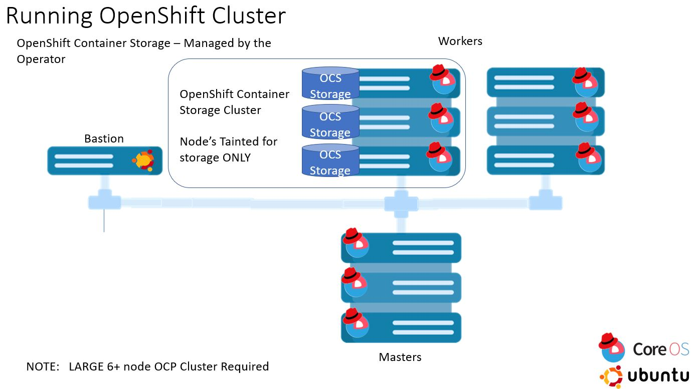

---
hide:
  - footer
---

#Deploying OCP
<html>
<body>

<button onclick="location.href='./HCCX-gym/'" class="custom-btn btn-7">HCCX Gym</button>
<button onclick="location.href='./GCP/'" class="custom-btn btn-7">GCP</button>
<button onclick="location.href='./Azure/'" class="custom-btn btn-7">Azure</button>
<button onclick="location.href='./AWS/'" class="custom-btn btn-7">AWS</button>

<button onclick="location.href='./VSphere/'" class="custom-btn btn-7">VSphere</button>
<button onclick="location.href='./ROKS/'" class="custom-btn btn-7">ROKS</button>
<button onclick="location.href='./IBM/'" class="custom-btn btn-7">IBM</button>
<button onclick="location.href='./TechZone/'" class="custom-btn btn-7">TechZone</button>

  

</body>
</html>
