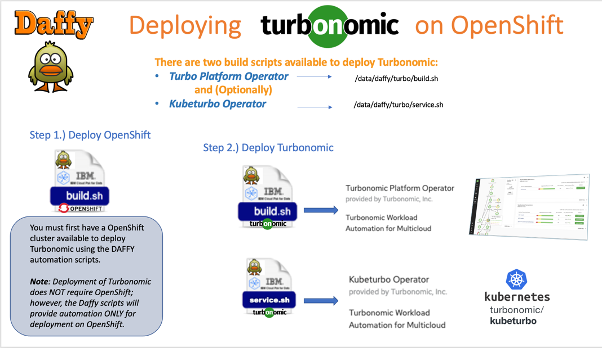

<script>
  document.title = "Supporting Software - Turbo";
</script>
# Turbonomic

!!! attention

	You will be required to provide a license key to fully enable the 	Turbonomic Platform. When the platform installation is complete, you will 	be presented with a URL where you will need to configure the administrator 	password and provide a valid Turbonomic license key.



!!! info inline end

	The default admin username for the Turbonomic Platform is:  
	**administrator** and you will have the ability to set the password when you configure the server after install.

KubeTurbo is the Turbo Metric Collector designed to send metrics and usage data from the Kubernetes environment to a Turbonomic Platform instance. Installing KubeTurbo will require you to provide the Turbonomic Platform topology processor URL and the administrator password.

##Turbonomic Platform

Turbonomic is an Application Resource Management (ARM) tool used to identify and automate critical actions that proactively deliver the most efficient use of compute, storage and network resources to your apps at every layer of the stack. Continuously, in real time and without human intervention.

**_REQUIRED ENVIRONMENT VARIABLES_**

```R
TURBO_PLATFORM_VERSION="8.5.4"
```

##Kubeturbo

Kubeturbo is an optional service that you can deploy to OpenShift. This will collect metrics from the OpenShift environment and send it to the Turbo Platform for display in the dashboard. You may configure the Kubeturbo to collect metrics and send data to an external Turbo Plaftorm, by overriding the values below.

**_OPTIONAL ENVIRONMENT VARIABLES_**

!!! info

	**TURBO_PLATFORM_URL** will be the "topology-processor" OpenShift ROUTE URL 	(If using the Turbo Platform Deployed by Daffy). If the Turbo Platform was deployed without DAFFY, the URL may be the nginx endpoint.

```R
TURBO_PLATFORM_URL="https://topology-processor-turbo.apps.yourdomain.net"
```

!!! info

	**TURBO_PLATFORM_USERNAME** Default value is: "administrator"

```R
TURBO_PLATFORM_USERNAME="administrator"
```

!!! info

	**TURBO_KUBE_CLUSTER_NAME** is the label of your cluster. This will be defaulted to the cluster name you specified in the env file.

```R
TURBO_KUBE_CLUSTER_NAME="gamma03"
```


## Executing Scripts

=== "Turbo Platform"

	``` title="Deploy Turbo Platform"
	/data/daffy/turbo/build.sh <env-prefix>
	```

=== "KubeTurbo"

	``` title="Deploy KubeTurbo"
	/data/daffy/turbo/service.sh <env-prefix>
	```
