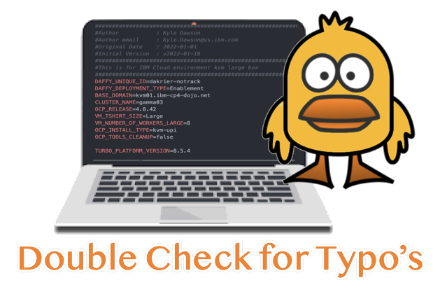

#Common Issues & Tips


If you run into issues with your install, please take the time to read the output of the script. In most cases, the output will give you a clear indication of what the problem is and in some cases how to fix it.

When reading the output during an error, always read messages starting from the top of your console output.  Daffy will try to find as many errors as it can, so **ALWAYS** start at the **top** of your output.




Most cases, the issue is a simple typo or a missing variable in the environment file. Please double check your environment file for any errors.


Run the /data/daffy/refresh.sh script to download the latest version of the daffy scripts.


Run the security-cleanup.sh script to remove all the sensitive data and the next time you run, the scripts will prompt you for the necessary input.

```
/data/daffy/security-cleanup.sh
```
