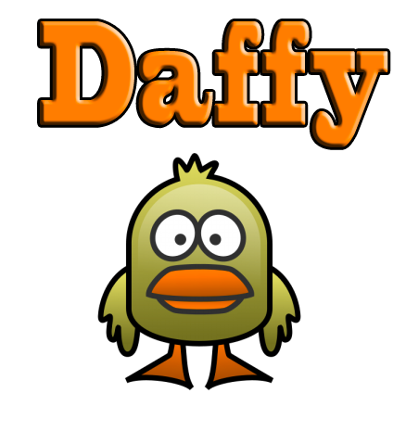

  

    <h1 style="display: inline"></h1>
  

  

  

    

      

        

          
        

        <button onclick="location.href='Deploying-OCP/Pre-Req/'" class="custom-btn btn-7">New User</button>
        <button onclick="location.href='Deploying-OCP/'" class="custom-btn btn-7">Experienced User</button>
      

      

        

          Daffy is <b>D</b>eployment <b>A</b>utomation <b>F</b>ramework <b>F</b>or <b>Y</b>ou. A tool to do all the heavy lifting of the OpenShift and IBM Cloud Pak installs. The National Market Top Team created Daffy to assist the technical sales teams with the progression of IBM Cloud Pak opportunities. The goal is to provide the technical sales with a set of (easy to use) scripts that will aid in the installation of OpenShift and the IBM Cloud Pak's.
        

      

    

  

  

    

      

        Fit for purpose
      

      

        Using Daffy IBMers, business partners and customers are onboarded to IBM Cloud Pak's in less than a few hours, removing challenges that previously existing setting up OpenShift.
      

    

  

!!! Warning "Important"
    ###Daffy scripts were designed to help pre-sales(CTP/BP) with POC deployments. If you choose to use this in a production environment, you may, but it will be on the installer for support of that installation.  IBM can not give support for daffy itself. As it relates to OpenShift and Cloud pak deployments, you can open ticket with IBM Support. The installer/business partner would need to verify  the environment that it meets all HA , best practices, management aspects and security requirements. As this is a scripting engine, you have full access to the logic/code and have ability to make any changes you feel fit. If you do make any changes to the daffy engine outside of your cluster environment file, you are on your own, we will not be able to assistant with that environment.  Please Refer to the Production Deployment Guides for the recommended approach when advising customers on how to deploy a Production Ready Environment.
